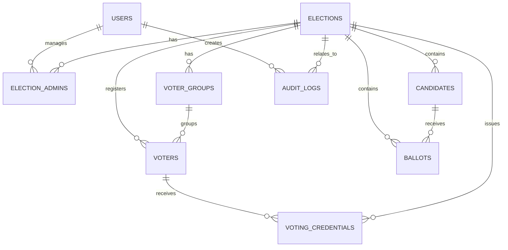

# ERD / Database Design — Sistem E-Voting Sekolah

**Dokumen:** 02 — ERD / Database Design  
**Versi:** 1.0  
**Status:** Draft  
**Mengacu pada:** `PRD_E_Voting_Sekolah.md`  
**Database:** PostgreSQL

---

## 1. Tujuan

Dokumen ini mendefinisikan rancangan database untuk sistem e-voting sekolah.

Prioritas desain:

1. Menjaga integritas data pemilihan.
2. Mencegah satu pemilih memberikan suara lebih dari satu kali.
3. Memisahkan identitas pemilih dari pilihan kandidat.
4. Mendukung banyak pemilihan dalam satu aplikasi.
5. Mendukung credential/token/QR.
6. Mendukung audit aktivitas administratif tanpa membocorkan pilihan pemilih.
7. Mendukung penghitungan hasil setelah pemilihan ditutup.
8. Mendukung mode kelas/TPS.

> **Prinsip utama:** `BALLOTS` tidak menyimpan `voter_id`.

---

# 2. Prinsip Arsitektur Data

Sistem membagi data menjadi tiga kelompok:

```text
IDENTITY / AUTHORIZATION
        │
        ├── users
        ├── voters
        └── voting_credentials

ELECTION CONFIGURATION
        │
        ├── elections
        ├── candidates
        └── voter_groups

ANONYMOUS VOTE DATA
        │
        └── ballots

SYSTEM AUDIT
        │
        └── audit_logs
```

Hubungan penting:

```text
VOTER ───────X──────> BALLOT
```

Tidak boleh ada foreign key:

```text
ballots.voter_id
```

dan tidak boleh ada mekanisme aplikasi yang menyimpan hubungan langsung antara pemilih dengan kandidat.

---

# 3. ERD Konseptual



**Catatan keamanan:** diagram di atas menunjukkan hubungan `VOTERS → VOTING_CREDENTIALS`, tetapi **tidak ada hubungan `VOTERS → BALLOTS`**.

---

# 4. Daftar Entitas

| Entitas | Fungsi |
|---|---|
| `users` | Akun administrator/operator |
| `elections` | Data pemilihan |
| `election_admins` | Relasi admin dengan pemilihan |
| `voter_groups` | Kelas/TPS/jurusan/kelompok |
| `voters` | Identitas pemilih |
| `voting_credentials` | Credential/token sekali pakai |
| `candidates` | Kandidat pemilihan |
| `ballots` | Suara anonim |
| `audit_logs` | Catatan aktivitas administratif |

---

# 5. Tabel `users`

Menyimpan akun pengguna internal sistem seperti Super Admin, Admin Pemilihan, dan Operator.

```text
users
────────────────────────────────
id
name
email
password
role
is_active
last_login_at
created_at
updated_at
```

### Field

| Field | Type | Constraint | Keterangan |
|---|---|---|---|
| `id` | BIGINT | PK | ID user |
| `name` | VARCHAR(150) | NOT NULL | Nama pengguna |
| `email` | VARCHAR(255) | UNIQUE | Email login |
| `password` | VARCHAR(255) | NOT NULL | Password hash |
| `role` | VARCHAR/ENUM | NOT NULL | `SUPER_ADMIN`, `ADMIN`, `OPERATOR` |
| `is_active` | BOOLEAN | DEFAULT TRUE | Status akun |
| `last_login_at` | TIMESTAMP | NULL | Login terakhir |
| `created_at` | TIMESTAMP | NOT NULL | Waktu dibuat |
| `updated_at` | TIMESTAMP | NOT NULL | Waktu diperbarui |

### Security

Password **tidak boleh disimpan plaintext**.

Gunakan hashing yang disediakan Laravel.

---

# 6. Tabel `elections`

Menyimpan data setiap pemilihan.

```text
elections
────────────────────────────────
id
name
slug
description
type
start_at
end_at
status
results_published_at
created_by
created_at
updated_at
```

### Field

| Field | Type | Constraint |
|---|---|---|
| `id` | BIGINT | PK |
| `name` | VARCHAR(255) | NOT NULL |
| `slug` | VARCHAR(255) | UNIQUE |
| `description` | TEXT | NULL |
| `type` | VARCHAR(50) | NOT NULL |
| `start_at` | TIMESTAMP | NOT NULL |
| `end_at` | TIMESTAMP | NOT NULL |
| `status` | VARCHAR(30) | NOT NULL |
| `results_published_at` | TIMESTAMP | NULL |
| `created_by` | BIGINT | FK → `users.id` |
| `created_at` | TIMESTAMP | NOT NULL |
| `updated_at` | TIMESTAMP | NOT NULL |

### Status

```text
DRAFT
SCHEDULED
OPEN
CLOSED
ARCHIVED
```

### Constraint

```text
start_at < end_at
```

---

# 7. Tabel `election_admins`

Menghubungkan admin/operator dengan pemilihan tertentu.

```text
election_admins
────────────────────────────────
id
election_id
user_id
role
created_at
```

### Field

| Field | Type | Constraint |
|---|---|---|
| `id` | BIGINT | PK |
| `election_id` | BIGINT | FK |
| `user_id` | BIGINT | FK |
| `role` | VARCHAR(30) | NOT NULL |
| `created_at` | TIMESTAMP | NOT NULL |

### Role

```text
ADMIN
OPERATOR
```

### Unique

```text
UNIQUE(election_id, user_id)
```

---

# 8. Tabel `voter_groups`

Digunakan untuk kelas, jurusan, angkatan, TPS, atau kelompok.

```text
voter_groups
────────────────────────────────
id
election_id
name
type
description
created_at
updated_at
```

### Field

| Field | Type | Constraint |
|---|---|---|
| `id` | BIGINT | PK |
| `election_id` | BIGINT | FK |
| `name` | VARCHAR(150) | NOT NULL |
| `type` | VARCHAR(50) | NOT NULL |
| `description` | TEXT | NULL |
| `created_at` | TIMESTAMP | NOT NULL |
| `updated_at` | TIMESTAMP | NOT NULL |

Contoh:

```text
name = "Kelas 9A"
type = "CLASS"
```

atau:

```text
name = "TPS 01"
type = "TPS"
```

---

# 9. Tabel `voters`

Menyimpan identitas pemilih.

```text
voters
────────────────────────────────
id
election_id
voter_group_id
student_id
name
class_name
status
voting_status
created_at
updated_at
```

### Field

| Field | Type | Constraint |
|---|---|---|
| `id` | BIGINT | PK |
| `election_id` | BIGINT | FK |
| `voter_group_id` | BIGINT | FK, NULL |
| `student_id` | VARCHAR(100) | NOT NULL |
| `name` | VARCHAR(255) | NOT NULL |
| `class_name` | VARCHAR(100) | NULL |
| `status` | VARCHAR(30) | NOT NULL |
| `voting_status` | VARCHAR(30) | NOT NULL |
| `created_at` | TIMESTAMP | NOT NULL |
| `updated_at` | TIMESTAMP | NOT NULL |

### Status

```text
ACTIVE
INACTIVE
```

### Voting Status

```text
NOT_VOTED
VOTED
```

### Unique

```text
UNIQUE(election_id, student_id)
```

Hal ini memungkinkan siswa yang sama ikut dalam beberapa pemilihan berbeda.

Contoh:

```text
Election 2026 → student_id 12345
Election 2027 → student_id 12345
```

keduanya valid.

---

# 10. Tabel `voting_credentials`

Menyimpan credential/token yang digunakan untuk mengotorisasi pemilih.

```text
voting_credentials
────────────────────────────────
id
election_id
voter_id
token_hash
status
expires_at
used_at
created_at
updated_at
```

### Field

| Field | Type | Constraint |
|---|---|---|
| `id` | BIGINT | PK |
| `election_id` | BIGINT | FK |
| `voter_id` | BIGINT | FK |
| `token_hash` | VARCHAR(255) | UNIQUE |
| `status` | VARCHAR(30) | NOT NULL |
| `expires_at` | TIMESTAMP | NULL |
| `used_at` | TIMESTAMP | NULL |
| `created_at` | TIMESTAMP | NOT NULL |
| `updated_at` | TIMESTAMP | NOT NULL |

### Status

```text
UNUSED
USED
REVOKED
EXPIRED
```

### Catatan penting

Database menyimpan:

```text
HASH(token)
```

bukan token asli.

Token plaintext hanya diberikan kepada pemilih pada saat provisioning/distribusi.

---

# 11. Tabel `candidates`

Menyimpan kandidat untuk sebuah pemilihan.

```text
candidates
────────────────────────────────
id
election_id
number
name
photo_path
vision
mission
status
created_at
updated_at
```

### Field

| Field | Type | Constraint |
|---|---|---|
| `id` | BIGINT | PK |
| `election_id` | BIGINT | FK |
| `number` | INTEGER | NOT NULL |
| `name` | VARCHAR(255) | NOT NULL |
| `photo_path` | VARCHAR(500) | NULL |
| `vision` | TEXT | NULL |
| `mission` | TEXT | NULL |
| `status` | VARCHAR(30) | NOT NULL |
| `created_at` | TIMESTAMP | NOT NULL |
| `updated_at` | TIMESTAMP | NOT NULL |

### Status

```text
ACTIVE
INACTIVE
```

### Unique

```text
UNIQUE(election_id, number)
```

Nomor kandidat tidak boleh duplikat dalam satu pemilihan.

---

# 12. Tabel `ballots`

Ini adalah tabel **paling sensitif**.

Menyimpan pilihan suara tanpa identitas pemilih.

```text
ballots
────────────────────────────────
id
election_id
candidate_id
ballot_hash
created_at
```

### Field

| Field | Type | Constraint |
|---|---|---|
| `id` | BIGINT | PK |
| `election_id` | BIGINT | FK |
| `candidate_id` | BIGINT | FK |
| `ballot_hash` | VARCHAR(255) | UNIQUE |
| `created_at` | TIMESTAMP | NOT NULL |

### Larangan

Tabel ini **tidak boleh memiliki**:

```text
voter_id
student_id
credential_id
username
email
IP address
```

sebagai data yang menghubungkan suara dengan pemilih.

---

# 13. `ballot_hash`

`ballot_hash` digunakan sebagai identifier/integrity reference untuk ballot.

Contoh konseptual:

```text
random ballot nonce
        +
election context
        ↓
hash
        ↓
ballot_hash
```

Tujuannya bukan untuk menyembunyikan `candidate_id` dari database.

Yang harus dijaga adalah **tidak adanya identifier pemilih dalam ballot**.

---

# 14. Tabel `audit_logs`

Menyimpan aktivitas administratif.

```text
audit_logs
────────────────────────────────
id
user_id
election_id
action
entity_type
entity_id
metadata
ip_address
user_agent
created_at
```

### Field

| Field | Type | Constraint |
|---|---|---|
| `id` | BIGINT | PK |
| `user_id` | BIGINT | FK, NULL |
| `election_id` | BIGINT | FK, NULL |
| `action` | VARCHAR(100) | NOT NULL |
| `entity_type` | VARCHAR(100) | NULL |
| `entity_id` | BIGINT | NULL |
| `metadata` | JSONB | NULL |
| `ip_address` | INET | NULL |
| `user_agent` | TEXT | NULL |
| `created_at` | TIMESTAMP | NOT NULL |

### Contoh action

```text
ELECTION_CREATED
ELECTION_OPENED
ELECTION_CLOSED
CANDIDATE_CREATED
VOTERS_IMPORTED
CREDENTIAL_GENERATED
RESULT_EXPORTED
ADMIN_LOGIN
```

### Larangan penting

Audit log **tidak boleh** mencatat:

```text
student_id + candidate_id
```

atau:

```text
voter_id + ballot_id
```

atau metadata yang memungkinkan hubungan langsung tersebut.

---

# 15. Relasi Database

```text
USERS
  │
  ├────────────── ELECTIONS.created_by
  │
  └────────────── ELECTION_ADMINS
                         │
                         ▼
                     ELECTIONS
                         │
          ┌──────────────┼──────────────┐
          │              │              │
          ▼              ▼              ▼
     CANDIDATES      VOTERS       VOTER_GROUPS
          │              │
          │              ▼
          │       VOTING_CREDENTIALS
          │
          ▼
       BALLOTS
```

Perhatikan:

```text
VOTERS ──> VOTING_CREDENTIALS

CANDIDATES ──> BALLOTS

VOTERS -X-> BALLOTS
```

---

# 16. Voting Transaction

Voting harus menggunakan transaction dan row locking.

Pseudo-flow:

```text
BEGIN

1. Validate election = OPEN

2. Find credential by token hash

3. Lock credential row
   SELECT ... FOR UPDATE

4. Check credential.status = UNUSED

5. Validate voter status

6. Validate candidate belongs to election

7. Create ballot
   - election_id
   - candidate_id
   - ballot_hash

8. Update credential
   status = USED
   used_at = NOW()

9. Update voter
   voting_status = VOTED

COMMIT
```

Jika terjadi error:

```text
ROLLBACK
```

---

# 17. Catatan tentang Anonimitas

Pemisahan tabel:

```text
voters
voting_credentials
ballots
```

menghilangkan hubungan database yang langsung antara:

```text
voter → candidate
```

Namun, anonimitas tidak hanya bergantung pada schema.

Implementasi juga harus menghindari korelasi melalui:

- Application logs.
- Web server logs.
- IP address.
- Request ID.
- Session ID.
- Timestamp yang terlalu presisi.
- Queue metadata.
- Monitoring tools.
- Database audit.
- Backup.
- Admin debugging.

### Prinsip

Data authorization:

```text
"Siswa A sudah menggunakan hak pilih."
```

boleh diketahui.

Data ballot:

```text
"Ada suara untuk Kandidat 02."
```

boleh diketahui.

Tetapi sistem tidak boleh menyediakan data:

```text
"Siswa A memilih Kandidat 02."
```

---

# 18. Hasil Voting

Hasil tidak perlu disimpan dalam tabel khusus untuk MVP.

Hasil dapat dihitung dari:

```sql
SELECT
    candidate_id,
    COUNT(*) AS total_votes
FROM ballots
WHERE election_id = ?
GROUP BY candidate_id;
```

Hanya query hasil yang boleh dieksekusi setelah:

```text
elections.status = CLOSED
```

### Persentase

```text
candidate_votes
--------------------- × 100
total_valid_ballots
```

---

# 19. Statistik Partisipasi

Partisipasi dihitung dari tabel `voters`.

```text
total_voters = COUNT(voters)

voted_voters =
COUNT(voters WHERE voting_status = 'VOTED')

participation =
(voted_voters / total_voters) × 100
```

Contoh:

```text
Total pemilih = 842
Sudah memilih = 671

Partisipasi =
671 / 842 × 100
= 79,69%
```

Statistik partisipasi tidak membutuhkan akses ke `ballots`.

---

# 20. Index yang Direkomendasikan

### `elections`

```text
INDEX(status)
INDEX(start_at)
INDEX(end_at)
```

### `voters`

```text
INDEX(election_id)
INDEX(voter_group_id)
INDEX(voting_status)
UNIQUE(election_id, student_id)
```

### `voting_credentials`

```text
UNIQUE(token_hash)
INDEX(election_id)
INDEX(voter_id)
INDEX(status)
```

### `candidates`

```text
INDEX(election_id)
UNIQUE(election_id, number)
```

### `ballots`

```text
INDEX(election_id)
INDEX(candidate_id)
UNIQUE(ballot_hash)
```

### `audit_logs`

```text
INDEX(user_id)
INDEX(election_id)
INDEX(action)
INDEX(created_at)
```

---

# 21. Constraint Penting

Database harus membantu menjaga integritas sistem.

### Pemilih

```text
UNIQUE(election_id, student_id)
```

### Kandidat

```text
UNIQUE(election_id, number)
```

### Credential

```text
UNIQUE(token_hash)
```

### Ballot

```text
UNIQUE(ballot_hash)
```

### Election

```text
start_at < end_at
```

---

# 22. Aturan Penghapusan Data

Untuk menjaga auditability, jangan menggunakan cascade delete secara sembarangan.

### Election

Pemilihan yang sudah pernah dibuka atau menerima suara **tidak boleh dihapus secara hard delete**.

Gunakan:

```text
ARCHIVED
```

atau soft delete untuk data yang memang diperbolehkan.

### Candidate

Setelah voting dibuka:

```text
NO DELETE
NO EDIT
```

### Voter

Setelah voting dibuka:

```text
NO DELETE
```

Jika perlu, ubah:

```text
status = INACTIVE
```

### Ballot

Setelah dibuat:

```text
NO UPDATE
NO DELETE
```

Ballot harus immutable.

---

# 23. Data Lifecycle

```text
DRAFT
  │
  ├── Import voters
  ├── Create candidates
  └── Generate credentials
  │
  ▼
OPEN
  │
  ├── Voting
  ├── Credential USED
  └── Ballot CREATED
  │
  ▼
CLOSED
  │
  ├── Count ballots
  ├── Publish results
  └── Export results
  │
  ▼
ARCHIVED
```

---

# 24. Data yang Boleh dan Tidak Boleh Berhubungan

| Data | Boleh mengetahui identitas pemilih? | Boleh mengetahui pilihan kandidat? |
|---|---:|---:|
| `voters` | Ya | Tidak |
| `voting_credentials` | Ya, sebagai authorization | Tidak |
| `ballots` | **Tidak** | Ya |
| `candidates` | Tidak | Ya |
| `audit_logs` | Admin/system actor | Tidak boleh menghubungkan pemilih → kandidat |

---

# 25. Contoh Data

### Voters

```text
id   student_id   name          voting_status
1    10001        Ahmad         VOTED
2    10002        Budi          NOT_VOTED
3    10003        Citra         VOTED
```

### Ballots

```text
id   election_id   candidate_id
1    10            2
2    10            1
```

Tidak ada informasi:

```text
Ahmad → candidate 2
Citra → candidate 1
```

---

# 26. Risiko Desain yang Harus Dihindari

## 26.1 `ballots.voter_id`

Jangan membuat:

```text
ballots
- id
- voter_id
- candidate_id
```

Karena administrator/database operator dapat langsung mengetahui pilihan pemilih.

## 26.2 Credential sebagai ballot ID

Jangan membuat:

```text
ballots.credential_id
```

karena hal tersebut dapat menghubungkan credential dengan suara.

## 26.3 Logging pilihan

Jangan melakukan:

```text
log("student {$studentId} voted for {$candidateId}");
```

## 26.4 Timestamp sebagai correlation key

Jangan membuat sistem yang secara sengaja menyimpan urutan:

```text
20:01:01 Student A VOTED
20:01:01 Ballot Candidate 02 CREATED
```

dengan identifier yang memungkinkan korelasi.

## 26.5 Admin dapat membuka ballot mentah dan voter bersamaan

Hak akses database dan aplikasi harus dibatasi.

---

# 27. Rekomendasi PostgreSQL

PostgreSQL dipilih karena mendukung:

- Foreign key.
- Check constraints.
- JSONB.
- Transaction.
- Row-level locking.
- `SELECT ... FOR UPDATE`.
- Partial/indexed queries.
- Reliable aggregation.

Contoh check constraint:

```sql
CHECK (start_at < end_at)
```

Contoh status constraint dapat menggunakan PostgreSQL enum atau string + application validation.

Untuk fleksibilitas migration Laravel, penggunaan `VARCHAR` + application enum juga dapat dipertimbangkan.

---

# 28. Migration Strategy

Urutan migration:

```text
1. users
2. elections
3. election_admins
4. voter_groups
5. voters
6. voting_credentials
7. candidates
8. ballots
9. audit_logs
```

Foreign key harus dibuat setelah tabel parent tersedia.

---

# 29. Seed Data Development

Environment development harus menyediakan data dummy.

Contoh:

```text
Election:
Pemilihan Ketua OSIM 2026

Candidates:
01 Ahmad
02 Budi
03 Citra

Voters:
10001 Demo Student 01
10002 Demo Student 02
10003 Demo Student 03
```

**Jangan pernah menggunakan data siswa asli di repository source code atau seed production.**

---

# 30. Backup dan Retention

Backup minimal mencakup:

```text
PostgreSQL database
Application configuration
Uploaded candidate photos
```

Backup harus diperlakukan sebagai data sensitif.

Khususnya karena backup dapat berisi:

```text
voters
voting_credentials
ballots
audit_logs
```

Backup harus:

- Dienkripsi.
- Memiliki akses terbatas.
- Memiliki retention policy.
- Diuji proses restore-nya.

---

# 31. Checklist Validasi ERD

- [ ] `ballots` tidak memiliki `voter_id`.
- [ ] `ballots` tidak memiliki `student_id`.
- [ ] `ballots` tidak memiliki `credential_id`.
- [ ] Credential disimpan sebagai hash.
- [ ] Satu siswa hanya terdaftar sekali dalam satu election.
- [ ] Nomor kandidat unik dalam satu election.
- [ ] Ballot immutable.
- [ ] Credential dapat digunakan satu kali.
- [ ] Voting menggunakan database transaction.
- [ ] Credential di-lock saat proses voting.
- [ ] Election yang sudah menerima suara tidak di-hard-delete.
- [ ] Candidate dikunci ketika voting OPEN.
- [ ] Audit log tidak menghubungkan voter dengan candidate.
- [ ] Backup diperlakukan sebagai data sensitif.
- [ ] Logging operasional tidak membocorkan pilihan pemilih.

---

# 32. Keputusan Desain Final

Untuk MVP, database menggunakan:

```text
users
elections
election_admins
voter_groups
voters
voting_credentials
candidates
ballots
audit_logs
```

Prinsip paling penting:

```text
VOTER
  │
  └── VOTING_CREDENTIAL
            │
            │  authorization only
            │
            X
            │
            │  NO DIRECT LINK
            │
          BALLOT
            │
            ▼
        CANDIDATE
```

Dengan demikian database memisahkan:

**Identity / Eligibility**

dari

**Anonymous Vote**.

---

# 33. Langkah Berikutnya

Setelah ERD ini disetujui, dokumen berikutnya yang perlu dibuat adalah:

```text
03 SECURITY.md
```

Dokumen tersebut harus mendefinisikan **threat model** secara lebih detail, termasuk:

- Siapa yang dipercaya.
- Apa yang dapat dilakukan admin.
- Apa yang dapat dilakukan operator.
- Apa yang terjadi jika database bocor.
- Apa yang terjadi jika token dicuri.
- Double voting.
- Replay attack.
- Concurrent voting.
- Session hijacking.
- CSRF/XSS.
- Brute force.
- IP/log correlation.
- Backup leakage.
- Privilege escalation.
- Integrity dan auditability.

Security design tersebut kemudian menjadi acuan implementasi Laravel, khususnya pada `VotingService`, authentication, authorization, transaction, logging, dan database access.
